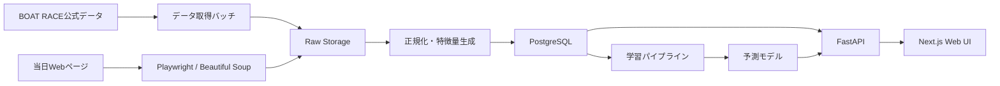

# ボートレース予想分析Webアプリ 開発ロードマップ

作成日: 2026-05-22
更新日: 2026-05-27

## 1. 目的

ボートレース公式データ、当日番組表、オッズ、気象条件、選手・モーター・レース場の特徴を統合し、各レースの1着確率、連対確率、3連対確率、期待値、買い目候補を提示する分析Webアプリを構築する。

最初から完全自動の投票判断ツールを目指すのではなく、以下を段階的に実現する。

- 過去データを安定して取得・蓄積する
- 選手、モーター、レース場、気象、展示、オッズを説明変数として整備する
- LightGBMまたはXGBoostで勝率予測モデルを作る
- 当日レースに対して予測結果をWeb画面で比較できる
- 予測確率とオッズから期待値を計算し、過去検証で収益性を評価する

## 2. 参照データ

### 公式データ

- レーサー期別成績ダウンロード
  - URL: https://www.boatrace.jp/owpc/pc/extra/data/download.html
  - 形式: LZH
  - 内容: BOAT RACE公式サイト上では、2002年以降の前期・後期データが提供されている。
  - 注意: そのままでは読めないため、LZH解凍処理が必要。

- 競走成績ダウンロード
  - 公式ページ上の「競走成績ダウンロード」リンクから取得する。
  - 全国24場で開催されたレース成績を取得する用途。

- 番組表ダウンロード
  - 公式ページ上の「番組表ダウンロード」リンクから取得する。
  - 当日・過去の出走表、枠番、選手、モーター、ボート、展示情報の取得に使う。

### 当日リアルタイム取得

- 本日のレース情報
- 出走表
- 直前情報
- 展示タイム
- チルト
- 進入
- スタート展示
- オッズ
- 記者予想
- 天候、気温、水温、風向、風速、波高

取得手段はPlaywrightを第一候補とし、HTML構造が安定しているページはBeautiful Soupで軽量に取得する。

## 3. 技術スタック

このプロジェクトでは開発速度よりも、長期運用、再現性、検証可能性、データ品質、予測根拠の説明しやすさを優先する。候補技術を並列に残すと管理対象が増えるため、原則として各領域の主採用技術を1つに絞る。

### バックエンド分析基盤

- Python
- Pandas
- NumPy
- LightGBM
- scikit-learn
- SHAP
- Optuna
- SQLAlchemy
- PostgreSQL
- Alembic
- Pydantic
- Pandera
- MLflow
- Prefect
- Playwright
- Beautiful Soup
- 7-Zip、またはunlha

### データ保存・管理

- PostgreSQL
- ローカルファイルストレージ
- S3互換オブジェクトストレージ
- Parquet
- CSV

PostgreSQLは正規化済みデータ、特徴量、予測結果、バックテスト結果を保存する。LZH、解凍後テキスト、取得HTML、オッズスナップショットなどのRawデータはファイルストレージに保存し、DBにはメタデータ、ハッシュ、取得日時、参照パスを保存する。分析用の中間データはParquetを基本とし、CSVは外部確認や一時出力に限定する。

### Webアプリケーション

- Next.js
- TypeScript
- React
- Tailwind CSS
- FastAPI
- OpenAPI
- TanStack Query
- Zod

FastAPIをAPI基盤として採用し、Firebase Cloud Functionsは採用しない。今回の要件では、Pythonの学習・推論処理、PostgreSQL、スクレイピング、バッチ実行を同じ設計思想で扱える構成のほうが保守しやすい。

Next.js側では、FastAPIが生成するOpenAPI定義からAPI型を生成する。フロントエンドの入力値やAPIレスポンスの境界ではZodを使い、画面内の非同期データ取得とキャッシュはTanStack Queryに寄せる。

### バッチ・スクレイピング

- Prefect
- Playwright
- Beautiful Soup
- httpx

Prefectで日次取得、当日更新、オッズ定期取得、学習、バックテストを管理する。PlaywrightはJavaScriptレンダリングや画面遷移が必要なページに限定し、静的HTMLで取得できるページはhttpxとBeautiful Soupで取得する。

### モデル管理・検証

- MLflow
- LightGBM
- scikit-learn
- SHAP
- Optuna
- pytest
- Pandera

MLflowで実験条件、特徴量セット、評価指標、モデルファイルを管理する。SHAPで予測根拠を説明し、Optunaでハイパーパラメータ探索を行う。Panderaで学習データ、推論データ、取り込みデータのスキーマを検証する。

### インフラ・開発環境

- Docker
- Docker Compose
- GitHub Actions

ローカル開発はDocker Composeで統一し、PostgreSQL、FastAPI、Next.js、Prefect、MLflowを起動できるようにする。本番運用を行う場合もコンテナ前提で移行しやすい構成にする。

### 品質管理・テスト

- pytest
- ruff
- mypy
- Playwright test
- ESLint
- Prettier
- TypeScript

Pythonはruff、mypy、pytestで品質を担保する。フロントエンドはTypeScript、ESLint、Prettier、Playwright testで型、整形、E2Eを管理する。

### 採用しない、または後回しにする技術

- XGBoost
  - LightGBMを主採用とし、モデル比較が必要になった段階で追加検討する。
- Firebase
  - Python分析基盤、PostgreSQL、バッチ処理との親和性を優先し、初期構成では採用しない。
- Celery
  - 当面のバッチ管理はPrefectに統合する。Webリクエストから重い非同期処理を大量投入する段階で再検討する。
- Kubernetes
  - 初期から導入すると運用負荷が大きいため、本番負荷やチーム規模が見えてから検討する。
- 専用Feature Store
  - 初期はPostgreSQL、Parquet、MLflowで特徴量管理を行う。特徴量の再利用やオンライン推論の要求が強くなった段階で検討する。

### 技術選定の方針

- 予測結果を後から再現できること
- どのデータ、どの特徴量、どのモデルで予測したか追跡できること
- 当日データ取得の失敗を検知できること
- 学習時に未来情報が混入しないこと
- オッズ込みモデルとオッズなしモデルを分けて比較できること
- 画面、API、モデル、バッチの責務を分離すること

## 4. 全体アーキテクチャ



## 5. フェーズ別ロードマップ

## Phase 0: 要件定義と検証方針

期間目安: 3日から1週間

### 実施内容

- 対象レース種別を定義する
  - 一般戦
  - G3
  - G2
  - G1
  - SG
  - 女子戦、ルーキー戦、マスターズ戦
- 予測対象を定義する
  - MVPは各艇の1着確率のみ
  - 2連対確率、3連対確率、3連単の組み合わせ確率は後回し
  - 展示後の補正予測は後回し
- 評価指標を決める
  - Log Loss
  - Brier Score
  - 的中率
  - 回収率
  - 的中時平均配当
  - 最大ドローダウン
- 利用規約、robots.txt、アクセス頻度、データ再配布可否を確認する

### 成果物

- 要件定義メモ
- データ利用ルール
- 評価指標一覧
- MVPスコープ

### 2026-05-27時点の進捗

Phase 0は完了。

進捗: 100%

完了内容:

- [x] 要件定義メモを作成した
- [x] データ利用ルールを作成した
- [x] 評価指標一覧を作成した
- [x] MVPスコープを固定した
- [x] BOAT RACE公式サイトのサイトポリシーを確認した
- [x] データダウンロードページの提供内容を確認した
- [x] robots.txtを確認した
- [x] 取得データの再配布を行わない方針を固定した
- [x] MVPをローカルDocker環境での個人利用に限定した

参照: `docs/PHASE0_REQUIREMENTS_AND_VALIDATION.md`

## Phase 1: プロジェクト初期構成

期間目安: 2日から4日

### ディレクトリ案

```text
boatrace-love/
  apps/
    web/
      Next.js app
    api/
      FastAPI app
  packages/
    shared/
      shared TypeScript types
  ml/
    pipelines/
    notebooks/
    models/
    features/
  data/
    raw/
    extracted/
    processed/
  infra/
    docker/
    db/
  docs/
```

### 実施内容

- Docker ComposeでPostgreSQL、FastAPI、Next.jsを起動できるようにする
- Python環境をuvまたはPoetryで固定する
- Node.js環境をpnpmで固定する
- DBマイグレーションにAlembicを導入する
- lint、format、testコマンドを整備する

### 成果物

- 開発環境
- DB接続
- 空のWeb画面
- FastAPIヘルスチェック

### 2026-05-27時点の進捗

Phase 1は完了。

進捗: 100%

完了または動作確認済み:

- ルート直下に`apps/`、`ml/`、`data/`、`infra/`、`docs/`、`scripts/`の基本構成がある
- `.gitignore`と`.env.example`がある
- Docker Composeで`postgres`、`api`、`web`、`prefect-server`、`mlflow`が起動する
- PostgreSQLへ接続できる
- Alembicで`alembic_version`、`data_sources`、`ingestion_runs`、`raw_files`を作成済み
- FastAPIの`GET /health`、`GET /db/health`、`GET /version`がCompose起動後に成功する
- Next.js初期画面は作成済みで、Compose起動後にHTTP 200を確認済み
- `apps/api/pyproject.toml`と`uv.lock`がある
- API DockerfileとWeb Dockerfileがある
- Rawデータ保存ディレクトリと`.gitkeep`が整備されている
- Prefect Server画面を開ける
- サンプルFlowを実行済み
- MLflow画面を開ける
- dummy runを登録済み
- APIの`ruff check`、`ruff format --check`、`mypy`、`pytest`が成功する
- Webの`format:check`、`lint`、`test:e2e`が成功する
- ルートREADMEに起動、疎通、DBマイグレーション、Prefect、MLflow、品質コマンドの確認手順がある

未完了タスク:

- なし

## Phase 2: 過去データ取得・LZH解凍

期間目安: 1週間から2週間

### 実施内容

- 公式ページからレーサー期別成績LZHファイルのURL一覧を取得する
- 年度、前期・後期、ファイルURL、取得日時を管理する
- LZHファイルをダウンロードする
- LZHを解凍する
- 文字コードを判定する
  - Shift_JIS
  - CP932
  - UTF-8
- レイアウト定義に基づいて固定長または区切り形式をパースする
- 取得済みファイルのハッシュを保存し、重複取得を避ける

### LZH対応方針

Python単体で処理できる場合は`lhafile`を利用する。環境差分が大きい場合は7-Zipなどの外部ツールをDockerイメージに含め、バッチ処理から呼び出す。

### DBテーブル案

- `data_sources`
- `download_files`
- `racer_period_stats_raw`
- `racer_period_stats`

### 成果物

- LZHダウンロードスクリプト
- 解凍スクリプト
- 期別成績のDB投入処理
- 取得ログ

## Phase 3: レース結果・番組表データの蓄積

期間目安: 2週間から4週間

### 実施内容

- 競走成績ダウンロードから過去レース結果を取得する
- 番組表ダウンロードから出走表を取得する
- レースIDを設計する
  - 開催日
  - レース場コード
  - レース番号
- 選手、モーター、ボート、枠番、進入、ST、着順、決まり手、払戻を正規化する
- 欠損、失格、欠場、フライング、出遅れを標準化する
- レース場マスタ、グレード、距離、安定板、周回短縮などを管理する

### 主要テーブル案

- `venues`
- `racers`
- `race_cards`
- `race_entries`
- `race_results`
- `payouts`
- `motors`
- `boats`
- `weather_observations`
- `odds_snapshots`

### 成果物

- 過去レースDB
- レース結果パーサー
- 番組表パーサー
- データ品質チェック

## Phase 4: 当日リアルタイムデータ取得

期間目安: 1週間から3週間

### 実施内容

- 当日開催場一覧を取得する
- 各場の1Rから12Rまでの出走表を取得する
- 直前情報を取得する
- オッズを時系列で取得する
- 記者予想を取得できる場合は保存する
- 気象情報を取得する
- スクレイピング頻度を制御する
- 取得失敗時のリトライ、バックオフ、HTML保存を実装する

### Playwrightを使う場面

- JavaScriptレンダリングが必要なページ
- セッションや動的遷移が必要なページ
- HTML構造が変化しやすく、画面確認が必要なページ

### Beautiful Soupを使う場面

- 静的HTMLで取得できるページ
- 軽量な一覧ページ
- バッチで大量取得するページ

### 成果物

- 当日データ取得ジョブ
- オッズスナップショット保存
- 直前情報保存
- 取得状況監視画面の土台

## Phase 5: 特徴量設計

期間目安: 3週間から6週間

### 選手特徴量

- 期別勝率
- 期別2連対率
- 期別3連対率
- 全国勝率
- 当地勝率
- モーター別成績
- コース別1着率
- コース別連対率
- 平均ST
- ST安定度
- フライング本数
- 出遅れ傾向
- 級別
- 支部
- 性別
- 年齢
- 体重
- 直近30走、60走、90走の成績
- グレード別成績
- ナイター成績
- 荒天時成績

### 選手同士の特徴量

- 同一レース出走履歴
- 直接対決勝率
- 枠番別の直接対決結果
- 進入隊形別の相性
- 同支部・同期・同世代フラグ

### モーター特徴量

- モーター2連対率
- モーター3連対率
- 使用開始日
- 使用年数
- 直近使用成績
- 整備履歴
- 部品交換履歴
- 展示タイムの変化
- 乗り手補正後のモーター評価

### レース場・環境特徴量

- レース場コード
- 水面特性
- イン有利度
- まくり発生率
- まくり差し発生率
- 逃げ成功率
- 風向
- 風速
- 気温
- 水温
- 波高
- 天候
- 季節
- 時間帯

### オッズ・市場特徴量

- 単勝オッズ
- 複勝オッズ
- 2連単オッズ
- 3連単オッズ
- オッズ変化率
- 人気順位
- 市場が見ている勝率
- 予測確率と市場確率の差
- 期待値

### 記者予想特徴量

- 本命印
- 対抗印
- 穴印
- 記者ごとの的中率
- 記者予想とモデル予想の乖離

### 成果物

- 特徴量生成パイプライン
- 特徴量定義書
- 欠損処理ルール
- 学習用データセット

## Phase 6: 機械学習モデル

期間目安: 3週間から6週間

### 初期モデル

最初は1艇ごとの「1着するか」を二値分類として扱う。

- 入力: レース内の各艇特徴量
- 出力: 各艇の1着確率
- モデル: LightGBM
- 後処理: 同一レース内で確率合計が1になるよう正規化

### 拡張モデル

- 2連対モデル
- 3連対モデル
- ランキング学習
- レース単位の多クラス分類
- 3連単組み合わせ確率モデル
- オッズ込みモデル
- オッズなし実力モデル
- 展示前モデル
- 展示後モデル

### 検証方法

- 時系列分割で検証する
- 未来データが学習に混ざらないようにする
- レース場別、グレード別、季節別に性能を確認する
- 回収率は過去オッズでシミュレーションする
- 過学習をFeature Importance、SHAP、期間外検証で確認する

### 成果物

- 学習スクリプト
- 評価レポート
- モデルファイル
- 特徴量重要度
- バックテスト結果

## Phase 7: 予測API

期間目安: 1週間から3週間

### API案

- `GET /health`
- `GET /venues/today`
- `GET /races/today`
- `GET /races/{race_id}`
- `GET /races/{race_id}/entries`
- `GET /races/{race_id}/odds`
- `GET /races/{race_id}/prediction`
- `POST /models/train`
- `GET /models/latest`
- `GET /backtests`

### 予測レスポンス案

```json
{
  "race_id": "20260522_01_11",
  "model_version": "lgbm_win_v1",
  "predicted_at": "2026-05-22T10:30:00+09:00",
  "entries": [
    {
      "boat_no": 1,
      "racer_no": "0000",
      "win_probability": 0.421,
      "place2_probability": 0.651,
      "place3_probability": 0.782,
      "market_probability": 0.385,
      "expected_value": 1.09
    }
  ]
}
```

### 成果物

- FastAPIアプリ
- OpenAPI定義
- 推論サービス
- DB接続
- エラーハンドリング

## Phase 8: Webフロントエンド

期間目安: 2週間から4週間

### 主要画面

- 今日の開催一覧
- レース一覧
- レース詳細
- 予測比較
- 出走表
- 選手詳細
- モーター詳細
- オッズ推移
- 期待値ランキング
- バックテスト画面
- モデル性能画面

### レース詳細で表示する情報

- 枠番
- 登録番号
- 選手名
- 級別
- 支部
- 年齢
- 全国勝率
- 当地勝率
- モーター2連対率
- 展示タイム
- ST
- フライング本数
- 予測1着率
- 予測2連対率
- 予測3連対率
- オッズ
- 期待値
- 記者印

### UI方針

- ダッシュボード型の実用画面にする
- 情報密度を高くしつつ、レース単位で比較しやすくする
- 予測確率、市場確率、期待値の差分を色で表現する
- スマートフォンでは開催場、レース、買い目候補の確認に絞る

### 成果物

- Next.jsアプリ
- APIクライアント
- レース詳細UI
- 予測ランキングUI
- レスポンシブ対応

## Phase 9: バックテスト・期待値分析

期間目安: 2週間から5週間

### 実施内容

- 過去レースを対象に予測を再現する
- 当時取得可能だった情報だけを使う
- オッズの時点を指定して検証する
- 買い条件を定義する
  - 予測勝率が市場確率を一定以上上回る
  - 期待値が1.0以上
  - 最低オッズ
  - 最大オッズ
  - レース場限定
  - グレード限定
- 資金配分を検証する
  - 均等買い
  - Kelly基準の簡易版
  - 上限金額付き期待値買い

### 成果物

- バックテストエンジン
- 回収率レポート
- リスク指標
- 買い条件プリセット

## Phase 10: 運用・監視

期間目安: 2週間から4週間

### 実施内容

- 毎日早朝に番組表を取得する
- 展示開始後に直前情報を更新する
- オッズを定期取得する
- レース締切前に予測を再計算する
- 結果確定後に成績を取り込む
- モデルの予測精度を日次で集計する
- スクレイピング失敗を通知する
- DBバックアップを自動化する

### 成果物

- 日次バッチ
- ジョブ監視
- ログ管理
- モデル再学習フロー

## 6. MVPスコープ

最初のMVPは以下に絞る。

### MVPに含める

- レーサー期別成績のLZH取得・解凍・DB投入
- 過去レース結果の取得・DB投入
- 当日番組表の取得
- 選手、枠番、レース場、モーターの基本特徴量
- LightGBMによる1着確率予測
- 今日のレース一覧
- レース別の1着確率表示
- オッズと予測確率の比較
- 簡易バックテスト

### MVPでは後回し

- 記者予想の詳細解析
- 3連単全組み合わせの高精度予測
- 部品交換・整備履歴の高度な補正
- 資金配分最適化
- ユーザーアカウント
- 通知機能
- クラウド本番運用

## 7. 推奨マイルストーン

### Milestone 1: データ基盤

目標: 過去データをPostgreSQLに安定投入できる。

- LZH取得
- LZH解凍
- 期別成績パース
- レース結果パース
- 番組表パース
- DB設計

### Milestone 2: 初期モデル

目標: 過去データから1着確率を予測できる。

- 特徴量生成
- LightGBM学習
- 時系列検証
- 特徴量重要度確認
- モデル保存

### Milestone 3: 当日予測

目標: 今日のレースに対して予測値を出せる。

- 当日番組表取得
- オッズ取得
- 推論API
- レース別予測保存

### Milestone 4: Webアプリ

目標: ブラウザで予測を確認できる。

- Next.js画面
- FastAPI連携
- レース詳細
- 期待値表示

### Milestone 5: 精度改善

目標: 予測精度と回収率を継続的に改善する。

- 展示情報追加
- 気象情報追加
- モーター補正
- 直接対決特徴量
- バックテスト高度化

## 8. リスクと対策

### データ形式の変更

公式データやHTML構造が変更される可能性がある。

対策:

- Raw HTML、Rawファイルを保存する
- パーサーの単体テストを作る
- 取得失敗時に通知する

### LZH解凍環境の差分

OSやPythonライブラリによってLZH解凍が不安定になる可能性がある。

対策:

- Docker内に解凍ツールを固定する
- 解凍後ファイルのハッシュと件数を検証する

### 未来情報の混入

学習時にレース後にしか分からない情報が混ざると、実運用で性能が落ちる。

対策:

- 特徴量ごとに利用可能時点を管理する
- 学習データ作成時に時点制約を入れる
- 展示前モデルと展示後モデルを分ける

### オッズ依存

オッズを入れると市場の集合知に強く依存し、モデル独自の価値が見えにくくなる。

対策:

- オッズなしモデルとオッズありモデルを分ける
- 市場確率との差分を評価する

### 過剰な買い目提示

予測確率が高くても期待値が低い場合がある。

対策:

- 的中率と回収率を分けて表示する
- 期待値、信頼度、過去検証件数を併記する

## 9. DB設計の初期案

```sql
CREATE TABLE venues (
  id SERIAL PRIMARY KEY,
  code TEXT UNIQUE NOT NULL,
  name TEXT NOT NULL
);

CREATE TABLE racers (
  id SERIAL PRIMARY KEY,
  racer_no TEXT UNIQUE NOT NULL,
  name TEXT NOT NULL,
  branch TEXT,
  gender TEXT,
  birth_date DATE
);

CREATE TABLE races (
  id TEXT PRIMARY KEY,
  race_date DATE NOT NULL,
  venue_code TEXT NOT NULL,
  race_no INTEGER NOT NULL,
  grade TEXT,
  distance INTEGER,
  deadline_at TIMESTAMPTZ
);

CREATE TABLE race_entries (
  id SERIAL PRIMARY KEY,
  race_id TEXT NOT NULL REFERENCES races(id),
  boat_no INTEGER NOT NULL,
  racer_no TEXT NOT NULL,
  motor_no TEXT,
  boat_item_no TEXT,
  UNIQUE (race_id, boat_no)
);

CREATE TABLE predictions (
  id SERIAL PRIMARY KEY,
  race_id TEXT NOT NULL REFERENCES races(id),
  model_version TEXT NOT NULL,
  predicted_at TIMESTAMPTZ NOT NULL,
  payload JSONB NOT NULL
);
```

## 10. 初期タスク一覧

### Week 1

- リポジトリ構成を作る
- Docker ComposeでPostgreSQLを起動する
- FastAPIのヘルスチェックを作る
- Next.jsの初期画面を作る
- 公式ダウンロードページのURL収集スクリプトを作る

### Week 2

- LZHダウンロード・解凍処理を作る
- レーサー期別成績のパーサーを作る
- DB投入処理を作る
- データ品質チェックを作る

### Week 3

- 競走成績・番組表データの取得処理を作る
- レース、出走、結果テーブルを整備する
- 過去レースの基本集計を作る

### Week 4

- 初期特徴量を作る
- LightGBMの学習スクリプトを作る
- 時系列検証を行う
- 初期モデルの評価レポートを作る

### Week 5

- 当日番組表取得を作る
- 推論APIを作る
- Web画面に今日のレース一覧と予測を表示する

### Week 6

- オッズ取得を追加する
- 期待値計算を追加する
- 簡易バックテストを追加する
- UIを改善する

## 11. 開発時の注意

- ギャンブルの結果を保証する表現は避ける
- 「予想」ではなく「統計モデルによる推定確率」として表示する
- 回収率の検証は十分なサンプル数で行う
- 的中率だけでなく、期待値とリスクを同時に見る
- 公式サイトへのアクセス頻度を抑える
- 取得データの再配布可否を確認する
- 個人利用、研究利用、本番公開の線引きを明確にする

## 12. 完成イメージ

ユーザーは今日の開催場を選び、各レースについて以下を確認できる。

- モデル予測の1着率、2連対率、3連対率
- オッズから逆算した市場確率
- モデル予測と市場評価の差
- 期待値が高い艇や買い目
- 選手・モーター・展示・気象の根拠
- 過去類似条件での成績
- モデル全体の直近的中率と回収率

最終的には「当たる・外れる」だけでなく、なぜその予測になったのか、どの条件でモデルが強いのか、どの場やレースタイプでは避けるべきかを判断できる分析アプリを目指す。
