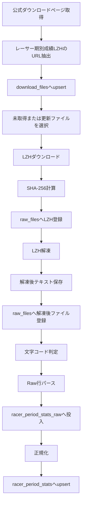

# Phase 2 過去データ取得・LZH解凍 設計書

作成日: 2026-05-27
ステータス: 着手前

## 1. Phase 2の目的

Phase 2では、BOAT RACE公式サイトが配布しているレーサー期別成績データを、再現可能な形で取得、保存、解凍、パースし、DBへ投入できる状態にする。

Phase 0で固定したMVP方針では、選手過去成績はT1当日朝モデルの主要な入力候補になる。したがって、このフェーズではモデルやWeb画面を作り込まず、後続フェーズで安心して使える履歴データ取得基盤を作る。

## 2. 現在の前提

## 2.1 Phase 0の固定ルール

Phase 2では以下を維持する。

- 予測対象は各艇の1着確率のみ
- オッズは学習特徴量に入れない
- MVPは当日朝時点の展示前モデルに限定する
- Rawデータは必ず保存する
- 取得元URL、取得日時、ハッシュ、成功/失敗、失敗理由を追跡する
- 取得データの再配布は行わない
- MVPはローカルDocker環境での個人利用に限定する

## 2.2 Phase 1の成果物

Phase 1で以下が利用可能になっている。

- Docker Compose
- PostgreSQL
- FastAPI
- Next.js
- Prefect Server
- MLflow Tracking Server
- Alembic
- API/Webの品質チェック
- Rawデータ保存ディレクトリ
- `data_sources`、`ingestion_runs`、`raw_files`

現在の主なディレクトリ構成:

```text
apps/
  api/
    app/
    alembic/
    tests/
  web/
data/
  raw/
    official_downloads/
      racer_period_stats/
      race_results/
      race_cards/
    lzh/
    extracted/
    html/
    odds/
  interim/
  processed/
  external/
docs/
infra/
ml/
scripts/
```

## 3. Phase 2で作るもの

Phase 2の対象は、まずレーサー期別成績データに絞る。

作るもの:

- 公式ダウンロードページからレーサー期別成績LZHのURL一覧を取得する処理
- 配布ファイルの年度、期、URL、ファイル名を管理するDBテーブル
- LZHファイルのダウンロード処理
- Raw LZH保存処理
- SHA-256ハッシュによる重複検知
- LZH解凍処理
- 解凍後テキストのRaw保存処理
- 文字コード判定と正規化読み込み
- レイアウト定義に基づく期別成績パーサー
- Raw行テーブルへの投入処理
- 正規化テーブルへの投入処理
- 冪等に再実行できる取り込みスクリプト
- 取り込み件数、失敗件数、ハッシュ、処理時間を確認できるログ

## 4. Phase 2でまだ作らないもの

以下はPhase 2では作らない。

- 競走成績ダウンロードの本実装
- 番組表ダウンロードの本実装
- 当日リアルタイム取得
- オッズ取得
- 特徴量生成
- 学習データセット作成
- LightGBMモデル学習
- Web画面での期別成績表示
- 自動買い目生成

ただし、Phase 2の実装中にPhase 1の管理テーブルやディレクトリ構成を改良したほうが明らかに良い場合は、互換性よりも長期運用のしやすさを優先して改変する。

## 5. 取得対象

取得元:

- BOAT RACE公式サイトのデータダウンロードページ
- レーサー期別成績ダウンロード

取得するメタデータ:

- データ種別
- 年度
- 前期/後期
- ページ上の表示名
- ファイルURL
- ファイル名
- 初回検出日時
- 最終確認日時
- ダウンロード状態
- SHA-256

取得頻度:

- 開発中は手動実行
- 後続フェーズではPrefectのFlowとして定期実行できる形にする

アクセス方針:

- 並列ダウンロードは初期実装では行わない
- リクエスト間に短い待機時間を入れる
- 失敗時は指数バックオフではなく、まず明示的な失敗ログを残す
- 同じハッシュのファイルは再保存しない

## 6. 保存設計

## 6.1 ファイル保存

LZHファイル:

```text
data/raw/official_downloads/racer_period_stats/{period_year}/{term}/{filename}
```

解凍後テキスト:

```text
data/raw/extracted/racer_period_stats/{period_year}/{term}/{extracted_filename}
```

パース前後の検証用中間ファイルを出す場合:

```text
data/interim/racer_period_stats/
```

ファイル名は、Phase 1の命名規則を基本にしつつ、公式配布ファイル名を保持する。

```text
{source}_{data_type}_{period_year}_{term}_{fetched_at}_{sha256_prefix}.{ext}
```

## 6.2 DB保存

既存テーブルの役割:

| テーブル | 役割 |
|---|---|
| `data_sources` | 取得元サイトを管理する |
| `ingestion_runs` | 取り込みジョブの実行単位を管理する |
| `raw_files` | ローカルに保存した物理ファイルを管理する |

Phase 2で追加する候補:

| テーブル | 役割 |
|---|---|
| `download_files` | 公式ページ上で検出した配布ファイルの論理台帳 |
| `racer_period_stats_raw` | 解凍後テキストのRaw行、またはRawフィールドを保存する |
| `racer_period_stats` | 期別成績を分析しやすい型に正規化して保存する |

`raw_files`と`download_files`は分ける。`download_files`は公式ページ上の配布単位、`raw_files`は実際に保存したファイル単位を表す。

## 7. テーブル設計方針

## 7.1 `download_files`

主なカラム:

| カラム | 型 | 内容 |
|---|---|---|
| `id` | bigserial | 主キー |
| `source_id` | integer | `data_sources.id` |
| `data_type` | text | `racer_period_stats` |
| `period_year` | integer | 対象年度 |
| `period_term` | text | `first_half`または`second_half` |
| `display_name` | text | 公式ページ上の表示名 |
| `source_url` | text | ダウンロードURL |
| `source_filename` | text | 公式ファイル名 |
| `status` | text | `discovered`、`downloaded`、`extracted`、`parsed`、`failed` |
| `raw_lzh_file_id` | bigint | LZHの`raw_files.id` |
| `extracted_file_id` | bigint | 解凍後テキストの`raw_files.id` |
| `sha256` | text | LZHファイルのハッシュ |
| `first_seen_at` | timestamptz | 初回検出日時 |
| `last_seen_at` | timestamptz | 最終確認日時 |
| `error_message` | text | 失敗理由 |

一意制約候補:

```text
(data_type, period_year, period_term, source_url)
```

## 7.2 `racer_period_stats_raw`

目的:

- 公式データのRawに近い状態を失わない
- パーサー修正時に再正規化できるようにする
- 変換失敗行を捨てずに追跡する

主なカラム:

| カラム | 型 | 内容 |
|---|---|---|
| `id` | bigserial | 主キー |
| `download_file_id` | bigint | `download_files.id` |
| `raw_file_id` | bigint | 解凍後テキストの`raw_files.id` |
| `line_number` | integer | 行番号 |
| `raw_text` | text | 元行 |
| `raw_fields` | jsonb | レイアウト適用後の未正規化フィールド |
| `parse_status` | text | `parsed`または`failed` |
| `parse_error` | text | 失敗理由 |
| `parser_version` | text | パーサーバージョン |
| `created_at` | timestamptz | 作成日時 |

## 7.3 `racer_period_stats`

目的:

- 後続の特徴量生成で扱いやすい型にする
- 同じ期、同じ登録番号の重複を避ける

初期カラム候補:

| カラム | 型 | 内容 |
|---|---|---|
| `id` | bigserial | 主キー |
| `download_file_id` | bigint | `download_files.id` |
| `period_year` | integer | 対象年度 |
| `period_term` | text | 前期/後期 |
| `racer_registration_no` | text | 登録番号 |
| `racer_name` | text | 選手名 |
| `branch` | text | 支部 |
| `racer_class` | text | 級別 |
| `raw_values` | jsonb | 正規化前の値を保持 |
| `normalized_values` | jsonb | 数値化・標準化済みの補助値 |
| `created_at` | timestamptz | 作成日時 |
| `updated_at` | timestamptz | 更新日時 |

実際の列は公式ファイルのレイアウト確認後に確定する。最初から無理に全列を固定せず、`raw_values`と`normalized_values`を併用して、データ損失を避けながら段階的に型を固める。

一意制約候補:

```text
(period_year, period_term, racer_registration_no)
```

## 8. 実装構成案

APIアプリ内:

```text
apps/api/app/
  ingestion/
    __init__.py
    official_downloads.py
    file_storage.py
    hashing.py
    archive.py
    encoding.py
    racer_period_stats/
      __init__.py
      discover.py
      download.py
      extract.py
      layouts.py
      parse.py
      load.py
      flow.py
  models/
    downloads.py
    racer_period_stats.py
```

スクリプト:

```text
scripts/
  phase2_discover_racer_period_stats.py
  phase2_ingest_racer_period_stats.py
  phase2_validate_racer_period_stats.py
```

テスト:

```text
apps/api/tests/
  ingestion/
    fixtures/
    test_official_downloads.py
    test_archive.py
    test_encoding.py
    test_racer_period_stats_parse.py
    test_racer_period_stats_load.py
```

## 9. LZH解凍方針

第一候補:

- Dockerイメージに7-Zip系のCLIを入れ、Pythonから呼び出す

理由:

- LZHは古い形式で、Pythonライブラリだけに寄せると対応形式や環境差分のリスクがある
- Docker内にCLIを固定すれば、Windows/WSL/本番候補環境の差分を減らせる

第二候補:

- `lhafile`などのPythonライブラリ

採用条件:

- 公式LZHの実ファイルを安定して解凍できる
- CI/Docker上で同じ結果になる
- エラー時に十分な情報を返せる

実装方針:

- `archive.py`に解凍処理を隠蔽する
- 呼び出し側はCLIかPythonライブラリかを意識しない
- 解凍後ファイルのSHA-256も保存する

## 10. 文字コードとパース方針

文字コード候補:

- CP932
- Shift_JIS
- UTF-8

方針:

- まずBOMと明示的なUTF-8判定を行う
- 次にCP932で読み込みを試す
- 失敗時はShift_JISを試す
- 判定したエンコーディングを`raw_files.metadata`と`download_files`関連ログに残す

パース方針:

- 公式レイアウトが固定長なら、レイアウト定義をコード内の辞書または設定ファイルとして持つ
- 区切り形式なら、区切り文字、列数、ヘッダー有無を明示する
- パース失敗行は捨てずに`racer_period_stats_raw`へ`failed`として残す
- 数値変換、空文字、全角空白、記号の処理は正規化層で行う

## 11. 処理フロー



## 12. 冪等性ルール

同じ処理を複数回実行しても、DBとファイルが破綻しないようにする。

- `download_files`はURL、年度、期でupsertする
- LZHの保存はSHA-256で重複判定する
- `raw_files`は同一`sha256`と`local_path`を重複登録しない
- `racer_period_stats_raw`は`download_file_id`と`line_number`で重複させない
- `racer_period_stats`は`period_year`、`period_term`、`racer_registration_no`でupsertする
- 失敗した`ingestion_runs`は残し、再実行時に新しいrunを作る

## 13. 完了条件

Phase 2は以下をすべて満たしたら完了とする。

| 完了条件 | 判定方法 |
|---|---|
| 公式ページからレーサー期別成績LZHのURL一覧を取得できる | discoveryスクリプトがURL、年度、期をDBへ保存する |
| LZHファイルをダウンロードできる | 少なくとも1ファイルを保存し、SHA-256を記録できる |
| 公式ページ上の全レーサー期別成績LZHを取得対象として管理できる | `download_files`に全件が登録される |
| 同じ処理を再実行しても重複登録されない | 2回連続実行して件数が不自然に増えない |
| LZHをDocker環境で解凍できる | APIコンテナ内のコマンドで解凍テストが成功する |
| 解凍後テキストをRawとして保存できる | `data/raw/extracted/racer_period_stats/`に保存され、`raw_files`に登録される |
| 文字コードを判定し、読み込める | 判定結果がメタデータに残り、文字化けのないサンプル確認ができる |
| 期別成績をRaw行としてDB投入できる | `racer_period_stats_raw`に行数、失敗行数、parser versionが入る |
| 期別成績を正規化テーブルへ投入できる | `racer_period_stats`に年度、期、登録番号単位でupsertされる |
| 取り込みログを追跡できる | `ingestion_runs`に成功/失敗、開始/終了、エラー理由が残る |
| 品質チェックが通る | `ruff check`、`ruff format --check`、`mypy`、`pytest`が成功する |
| READMEまたはPhase 2ドキュメントに実行手順がある | 手元で再実行できるコマンドが記載されている |

## 14. タスク一覧

## 14.1 P0: 基盤

| ID | タスク | 完了条件 |
|---|---|---|
| P2-001 | Phase 2用ブランチを作る | `codex/phase2-data-ingestion`などで作業開始できる |
| P2-002 | API DockerfileへLZH解凍ツールを追加する | APIコンテナ内でLZH解凍コマンドが実行できる |
| P2-003 | `download_files`モデルとAlembic migrationを作る | migration適用後にテーブルが存在する |
| P2-004 | `racer_period_stats_raw`モデルとmigrationを作る | Raw行を保存できる |
| P2-005 | `racer_period_stats`モデルとmigrationを作る | 正規化行を保存できる |
| P2-006 | `data_sources`へBOAT RACE公式データ取得元を登録する仕組みを作る | 初回実行時にupsertされる |

## 14.2 P0: 取得・保存

| ID | タスク | 完了条件 |
|---|---|---|
| P2-101 | 公式ダウンロードページ取得処理を作る | HTMLを取得し、ステータスとサイズをログに残す |
| P2-102 | レーサー期別成績LZHリンク抽出処理を作る | URL、年度、期、表示名を抽出できる |
| P2-103 | `download_files`へのupsert処理を作る | 再実行しても重複しない |
| P2-104 | LZHダウンロード処理を作る | URLからファイルを保存できる |
| P2-105 | SHA-256計算と重複検知を作る | 同一ファイルの再保存を避けられる |
| P2-106 | `raw_files`登録処理を共通化する | LZHと解凍後ファイルの両方を登録できる |

## 14.3 P0: 解凍・パース

| ID | タスク | 完了条件 |
|---|---|---|
| P2-201 | LZH解凍ラッパーを作る | CLIまたはライブラリ差分を隠蔽できる |
| P2-202 | 解凍後テキスト保存処理を作る | 保存先とハッシュが追跡できる |
| P2-203 | 文字コード判定処理を作る | CP932/Shift_JIS/UTF-8を扱える |
| P2-204 | 公式レイアウト確認用のサンプル検証を行う | 1ファイルの列構造と行数を確認できる |
| P2-205 | 期別成績レイアウト定義を作る | parserが固定長または区切り形式を解釈できる |
| P2-206 | Raw行パーサーを作る | `racer_period_stats_raw`へ投入できる |
| P2-207 | 正規化処理を作る | `racer_period_stats`へupsertできる |

## 14.4 P1: 運用性

| ID | タスク | 完了条件 |
|---|---|---|
| P2-301 | 一括取り込みスクリプトを作る | discoveryからDB投入まで一気通貫で実行できる |
| P2-302 | 対象年度/期を絞るオプションを作る | 開発時に小さく検証できる |
| P2-303 | dry-runオプションを作る | DB更新前に対象件数を確認できる |
| P2-304 | Prefect Flow化する | 手動Flowとして実行できる |
| P2-305 | 取り込み結果サマリを出す | 成功件数、失敗件数、スキップ件数が分かる |

## 14.5 P1: テスト・品質

| ID | タスク | 完了条件 |
|---|---|---|
| P2-401 | HTMLリンク抽出テストを作る | fixture HTMLから期待URLを抽出できる |
| P2-402 | ハッシュ・保存処理テストを作る | 重複検知を確認できる |
| P2-403 | 解凍処理テストを作る | サンプルLZHまたはモックで成功/失敗を確認できる |
| P2-404 | 文字コード判定テストを作る | CP932/Shift_JIS/UTF-8サンプルを読める |
| P2-405 | パーサーテストを作る | サンプル行から期待フィールドを得られる |
| P2-406 | DB投入テストを作る | upsertと重複防止を確認できる |

## 14.6 P2: ドキュメント

| ID | タスク | 完了条件 |
|---|---|---|
| P2-501 | READMEへPhase 2実行手順を追記する | discovery、ingest、validateのコマンドが分かる |
| P2-502 | ロードマップのPhase 2進捗を更新する | 完了/未完了が明確になる |
| P2-503 | 公式ファイルレイアウトの確認結果を記録する | 後続フェーズでパーサー根拠を追える |

## 15. 推奨実装順序

1. Phase 2用ブランチを作成する
2. API DockerfileへLZH解凍ツールを追加する
3. DB migrationで`download_files`、`racer_period_stats_raw`、`racer_period_stats`を追加する
4. 公式ページHTML取得とリンク抽出を実装する
5. `download_files`へのupsertを実装する
6. 1ファイルだけダウンロード、保存、ハッシュ記録を実装する
7. LZH解凍と解凍後ファイル保存を実装する
8. 文字コード判定とサンプル読み込みを実装する
9. 公式レイアウトを確認し、パーサーを作る
10. Raw行テーブル投入を実装する
11. 正規化テーブル投入を実装する
12. 一括取り込みスクリプトとdry-runを作る
13. Prefect Flow化する
14. テストとREADMEを整える
15. ロードマップの進捗を更新する

## 16. 確認コマンド案

API品質:

```bash
cd apps/api
uv run ruff format .
uv run ruff check .
uv run mypy app
uv run pytest
```

DB migration:

```bash
docker compose exec api uv run alembic upgrade head
docker compose exec postgres psql -U boatrace -d boatrace_love -c "\\dt"
```

Phase 2 discovery:

```bash
docker compose exec api uv run python ../../scripts/phase2_discover_racer_period_stats.py
```

Phase 2 ingest:

```bash
docker compose exec api uv run python ../../scripts/phase2_ingest_racer_period_stats.py --limit 1
docker compose exec api uv run python ../../scripts/phase2_validate_racer_period_stats.py
```

## 17. リスクと対応

| リスク | 対応 |
|---|---|
| 公式ページのHTML構造が変わる | 抽出処理をHTML fixture付きでテストし、失敗時はURL一覧0件として検知する |
| LZH形式がPythonライブラリで解凍できない | Docker内の7-Zip系CLIを第一候補にする |
| 文字コード判定が誤る | 判定結果、失敗行、サンプル文字列をログに残す |
| 公式ファイルのレイアウトが年度で変わる | `parser_version`とレイアウト定義を持ち、年度別分岐を許容する |
| データ欠損や変換失敗がある | 行を捨てず、Rawテーブルに失敗理由付きで残す |
| 再実行で重複する | URL、ハッシュ、年度、期、登録番号の一意制約とupsertを使う |

## 18. Phase 2完了後の引き継ぎ

Phase 2完了時点で、Phase 3へ以下を引き継ぐ。

- 公式ダウンロードページから配布ファイルを検出する共通処理
- LZHダウンロード、保存、解凍、文字コード判定の共通処理
- Rawファイル台帳と取り込みログの運用ルール
- 期別成績の正規化テーブル
- 公式ファイルレイアウトに関する確認結果

Phase 3では、この基盤を使って競走成績ダウンロードと番組表ダウンロードへ対象を広げる。
